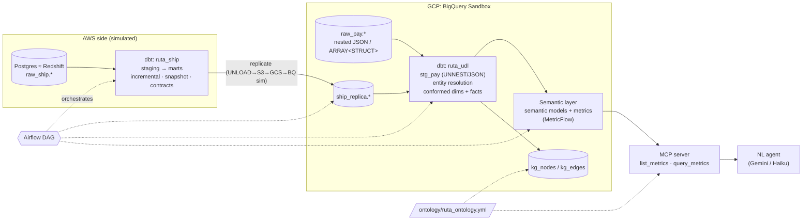

# Architecture

```mermaid
flowchart LR
  subgraph AWS["AWS side (simulated)"]
    PGraw[("Postgres ≈ Redshift<br/>raw_ship.*")]
    SHIP["dbt: ruta_ship<br/>staging → marts<br/>incremental · snapshot · contracts"]
    PGraw --> SHIP
  end

  subgraph GCP["GCP: BigQuery Sandbox"]
    BQraw[("raw_pay.*<br/>nested JSON / ARRAY&lt;STRUCT&gt;")]
    REP[("ship_replica.*")]
    UDL["dbt: ruta_udl<br/>stg_pay (UNNEST/JSON)<br/>entity resolution<br/>conformed dims + facts"]
    SEM["Semantic layer<br/>semantic models + metrics<br/>(MetricFlow)"]
    KG[("kg_nodes / kg_edges")]
    BQraw --> UDL
    REP --> UDL
    UDL --> SEM
    UDL --> KG
  end

  ONT[/"ontology/ruta_ontology.yml"/]
  SHIP -- "replicate (UNLOAD→S3→GCS→BQ sim)" --> REP
  ONT -.-> KG
  ONT -.-> MCP

  MCP["MCP server<br/>list_metrics · query_metrics"]
  AG["NL agent<br/>(Gemini / Haiku)"]
  SEM --> MCP --> AG

  AF{{"Airflow DAG"}} -.orchestrates.-> SHIP
  AF -.-> REP
  AF -.-> UDL
  AF -.-> SEM
```
