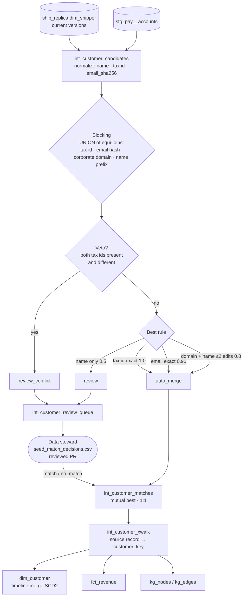

# Entity resolution (Phase 4)

```mermaid
flowchart TD
  ship[(ship_replica.dim_shipper<br/>current versions)] --> cand[int_customer_candidates<br/>normalize name · tax id · email_sha256]
  pay[(stg_pay__accounts)] --> cand
  cand --> block{Blocking<br/>UNION of equi-joins:<br/>tax id · email hash ·<br/>corporate domain · name prefix}
  block --> veto{Veto?<br/>both tax ids present<br/>and different}
  veto -- yes --> conflict[review_conflict]
  veto -- no --> score{Best rule}
  score -- "tax id exact 1.0" --> auto[auto_merge]
  score -- "email exact 0.95" --> auto
  score -- "domain + name ≤2 edits 0.8" --> auto
  score -- "name only 0.5" --> review[review]
  conflict --> queue[int_customer_review_queue]
  review --> queue
  queue --> steward([Data steward<br/>seed_match_decisions.csv<br/>reviewed PR])
  steward -- match / no_match --> matches
  auto --> matches[int_customer_matches<br/>mutual best · 1:1]
  matches --> xwalk[int_customer_xwalk<br/>source record → customer_key]
  xwalk --> dim[dim_customer<br/>timeline merge SCD2]
  xwalk --> rev[fct_revenue]
  xwalk --> kg[kg_nodes / kg_edges]
```

Results vs ground truth: precision 1.000 · recall 0.974 · no decoy merged · 15 true pairs waiting in the queue.
