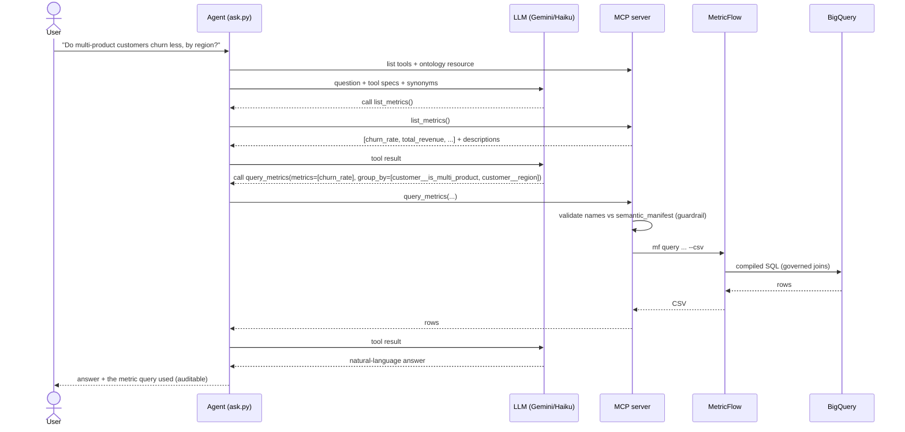

# NL agent sequence (Phase 6)

```mermaid
sequenceDiagram
  actor U as User
  participant A as Agent (ask.py)
  participant L as LLM (Gemini/Haiku)
  participant M as MCP server
  participant MF as MetricFlow
  participant BQ as BigQuery

  U->>A: "Do multi-product customers churn less, by region?"
  A->>M: list tools + ontology resource
  A->>L: question + tool specs + synonyms
  L-->>A: call list_metrics()
  A->>M: list_metrics()
  M-->>A: [churn_rate, total_revenue, ...] + descriptions
  A->>L: tool result
  L-->>A: call query_metrics(metrics=[churn_rate], group_by=[customer__is_multi_product, customer__region])
  A->>M: query_metrics(...)
  M->>M: validate names vs semantic_manifest (guardrail)
  M->>MF: mf query ... --csv
  MF->>BQ: compiled SQL (governed joins)
  BQ-->>MF: rows
  MF-->>M: CSV
  M-->>A: rows
  A->>L: tool result
  L-->>A: natural-language answer
  A-->>U: answer + the metric query used (auditable)
```
