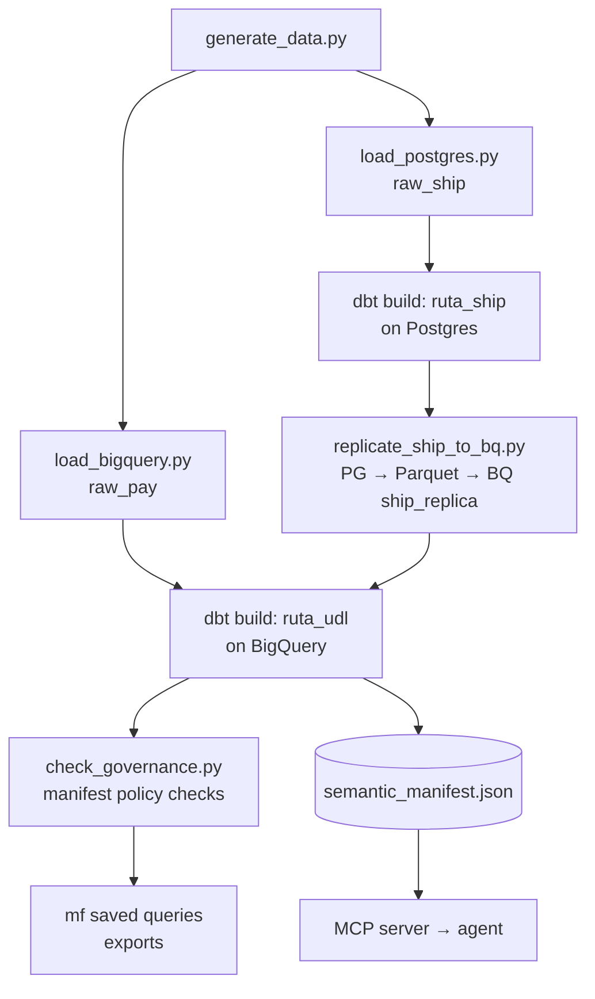

# Pipeline flow (Airflow DAG / Makefile)

```mermaid
flowchart TD
  A[generate_data.py] --> B[load_postgres.py<br/>raw_ship]
  A --> C[load_bigquery.py<br/>raw_pay]
  B --> D[dbt build: ruta_ship<br/>on Postgres]
  D --> E[replicate_ship_to_bq.py<br/>PG → Parquet → BQ ship_replica]
  C --> F[dbt build: ruta_udl<br/>on BigQuery]
  E --> F
  F --> G[check_governance.py<br/>manifest policy checks]
  G --> H[mf saved queries<br/>exports]
  F --> I[(semantic_manifest.json)]
  I --> J[MCP server → agent]
```
